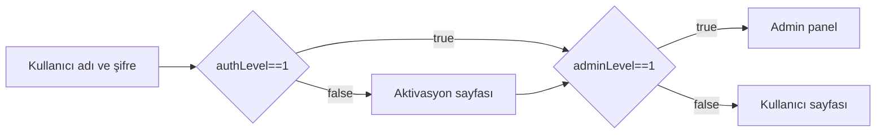

Güney Marmara Kalkınma Ajansı, Balıkesir Teknokent, Balıkesir Ticaret Odası ve Balıkesir Sanayi Odası işbirliği ile yürütülen **web geliştirme** eğitiminin bitirme projesi olarak **e-ticaretProjesi** adlı web projesini geliştirdim. Projede admin ve kullanıcı olmak üzere iki farklı kullanıcı tipi bulunmaktadır.Bu tiplere göre belirli özellikler sağlamaktadır.

## 1 - Admin Rolü 

* :moneybag: **Ciro İşlemleri :** Admin **eticaretProjesi** admin paneli ile tamamlanan ve bekleyen şipariş sayısını bununla birlikte gerçekleşen ciro ve beklenen ciro miktarını görebilir.

* :package: **Sipariş işlemleri :** Admin  **eticaretProjesi** admin panelininde siparişlerin detaylı bilgisini görüntüleyebilir,iptal edebilir,sipariş durumunu güncelleyebilirken sepetinde ürün unutan kullanıcılara özel indirim kuponu oluşturabilir.

* :pencil2:	**Ürün işlemleri:** Admin **eticaretProjesi** admin paneli ile sitede kullanıcılara gösterilen ürünlerin adını,resmini,fiyatını,stok durumunu görüntüleyebilir,güncelleyebilir,yeni ürün ekleyebilir.

* :man: **Kullanıcı İşlemleri :** Admin  **eticaretProjesi** admin panelininde kullanıcıların detaylı bilgisine ulaşabilir,güncelleyebilir ve silebilir.

## 2 - Kullanıcı Rolü

* :package: **Sipariş işlemleri :** Kullanıcı  **eticaretProjesi**  aracılığı ile geçmiş siparişlerin detaylı bilgisini görüntüleyebilir,iptal edebilir,sipariş durumunu görüntüleyebilir ayrıca indirim kuponlarını görüntüleyebilir,siparişlerinde kullanabilir.

* :1234: **Puanlama İşlemleri :** Kullanıcı **eticaretProjesi** aracılığı satın aldığı ürüne puan verebilir.

## 3 - Siteye Giriş Akış Şeması

## 4 - Kullanılan Teknolojiler

 

 

